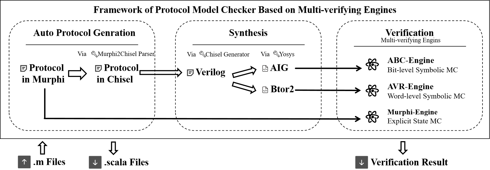
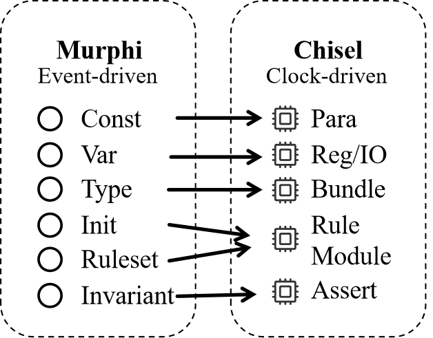
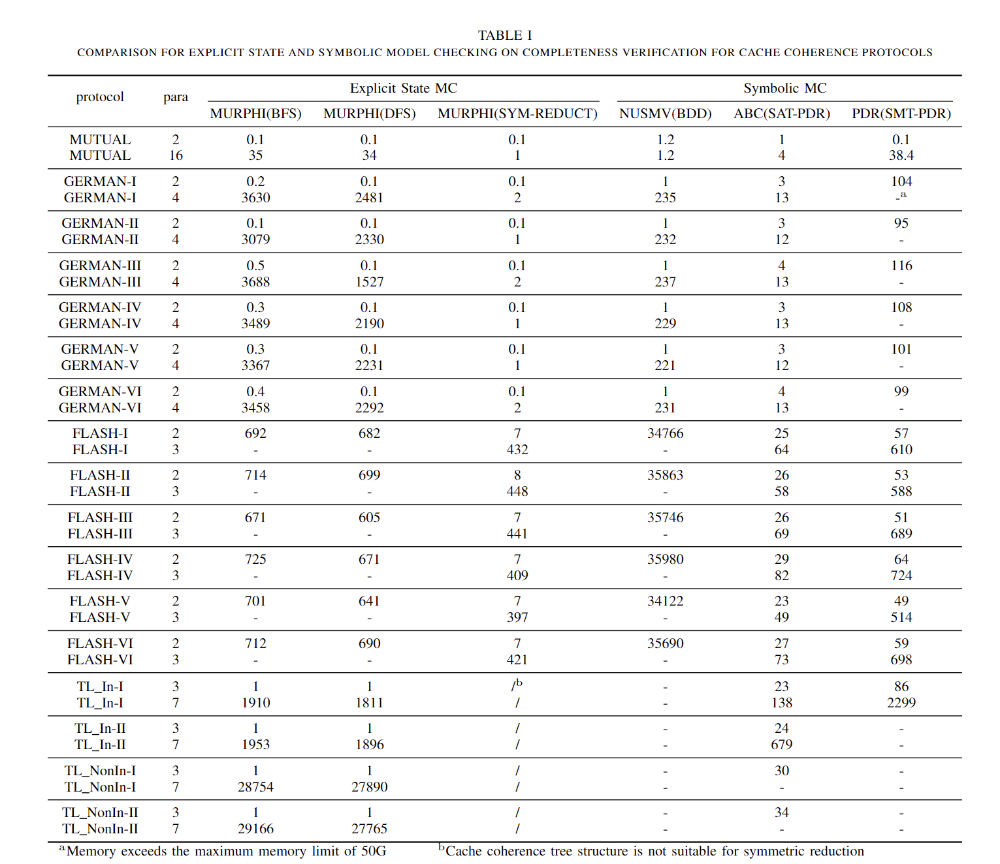
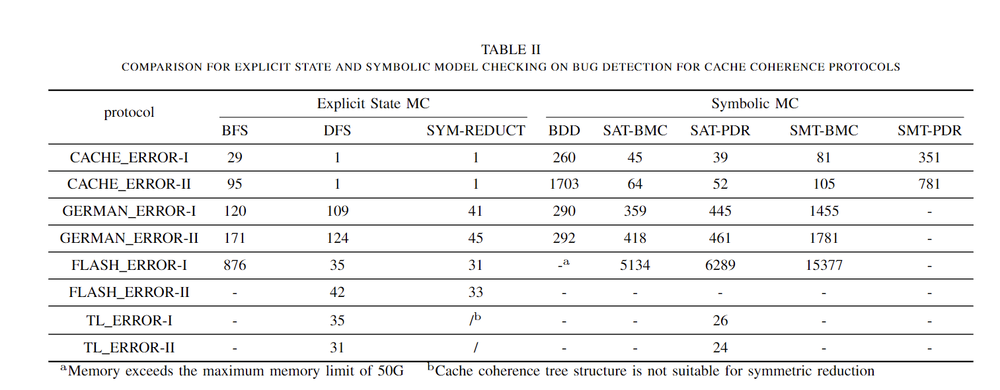

# Multi-verify Engine for Cache Coherence Protocols (Explicit State Model Checking Vs Symbolic Approaches)

In shared memory multiprocessor systems, implementing effective cache coherence protocols is indispensable for resolving issues related to cache inconsistency. This presents formidable challenges in both modeling and verifying these protocols. Various languages are employed for protocol modeling, each aligned with distinct computing models, such as the event-driven paradigm (e.g., Murphi) and the clock-driven paradigm (e.g., Chisel). The formal verification of protocols encompasses two primary methods: explicit State model checking and symbolic model checking. Each verification method necessitates input in different modeling languages. This paper introduces Murphi2Chisel, a compiler that establishes connections between the event-driven and clock-driven models, as well as between the two formal methods of explicit State model checking and symbolic model checking.
The scope of this paper unfolds in two key stages. In the initial phase, a compiler is developed to transform the Murphi-specified cache coherence protocol into Chisel circuits automatically. Subsequently, mirroring contemporary industrial verification practices that support multiple verification engines, we implement a multi-verifying engine for protocol verification facilitated by Murphi2Chisel. Drawing from the protocol equivalence model generated, we systematically compare the application of various methods involved in both explicit State model checking and symbolic model checking on cache coherence protocols.

## Installation

### pre-build

For some major parts of Murphi2Chisel functionality, Murphi2Chisel relies on tools from the OSS CAD Suite (https://github.com/YosysHQ/oss-cad-suite-build) and thus a prerequisite to unlock all features of Murphi2Chisel is to have a version of oss-cad-suite installed on your machine. You can get a ready to use version of oss-cad-suite at (https://github.com/YosysHQ/oss-cad-suite-build/releases). Follow the instructions in (https://github.com/YosysHQ/oss-cad-suite-build) to get a version.

This tool relies on a chisel and needs to be configured with the chisel. Chisel is a Scala library, and the easiest way to install Chisel and Scala is with sbt,the Scala build tool. Scala itself depends on the installation of Java JDK 1.8 (or a later version). As Oracle has changed the license for Java, it may be easier to install OpenJDK from AdoptOpenJDK.

```
sudo apt install openjdk-8-jdk git make gtkwave
```

Follow the instructions in (https://github.com/chipsalliance/chisel) to get a version of Chisel.

### Build from source

* Download/clone the GitHub repository
* Build from ./build.sh

```
cd src
sudo ./build.sh
```

# Usage

How to run Multi-verify Engine for Cache Coherence Protocols

```
usage: Murphi2Chisel [-h] [-v1] [-v2] [-v3] [-v4] [-v5] [-v6] [-p] [-f FILE] [-c CONSTLIST [CONSTLIST ...]] [-o OUT]

Multi-verify Engine for Cache Coherence Protocols (Explicit State Model Checking Vs Symbolic Approaches)

options:
  -h, --help            show this help message and exit
  -v1, --verifyabc      parse and verify in abc
  -v2, --verifyavr      parse and verify in avr
  -v3, --verifycmurphi  parse and verify in murphi
  -v4, --satbmc         parse and verify in satbmc
  -v5, --smtbmc         parse and verify in smtbmc
  -v6, --verifycmurphidfs
                        parse and verify in murphidfs
  -p, --parse           parse without verify in cmurphi
  -f FILE, --file FILE  input file in Muprhi
  -c CONSTLIST [CONSTLIST ...], --constlist CONSTLIST [CONSTLIST ...]
                        const params in the protocol
  -o OUT, --out OUT     output dirname

Murphi2Chisel
```

Example

```
# convert Murphi to Chisel and verify by abc pdr
python3 murphi2chisel.py -v1 -f benchmark/benchmark1/mutual-2.m -c 2 -o mutual

# convert Murphi to Chisel and verify by avr pdr
python3 murphi2chisel.py -v2 -f benchmark/benchmark1/mutual-2.m -c 2 -o mutual

# directly verify by murphi
python3 murphi2chisel.py -v3 -f benchmark/benchmark1/mutual-2.m -c 2 -o mutual
```

Test the benchmark

```
# If you want to test all the benchmark shown in the paper, run the python scipt in src dir
cd src && python3 test_script.py

```


## Framework



This tool is designed for design and formal verification (Model Checking) of cache coherence protocols，contains two parts：

* For a cache coherence protocol encoded by Murphi, we can automatically convert it to a Chisel circuit
* Explict-state model checking and symbolic model checking often have a big gap, but through the tools of this paper, we use ABC, AVR, and Murphi to verify the same cache coherence protocol.

## Compiler

### Ebnf.py

The syntax tree structure of Murphi is as follows. We encode it through python/lark, and the encoding format is ebnf.

```
    ?program: (decl)* (rules)*          -> program
    ?decl: ("const"|"Const") (constdecl ";")*     -> const
        | ("type"|"Type") (typedecl ";")*        -> type
        | ("var"|"Var") (vardecl ";")*          -> var
    ?constdecl: ID ":" expr             -> constdecl
    ?typedecl: ID ":" typeexpr          -> typedecl
    ?typeexpr: ID                       -> pretypedecl
        | ("boolean"|"Boolean")                     -> booleantypedecl
        | expr ".." expr                -> subrangetypedecl
        | "enum" "{" ID ( "," ID )* "}" -> enumtypedecl
        | ("record"|"Record") ( vardecl ";")* "end"    -> recordtypedecl
        | "array" "[" typeexpr "]" "of" typeexpr    -> arraytypedecl
    ?vardecl: ID ( "," ID )* ":" typeexpr       -> vardecl
    ?designator: ID ( (DOTID) | ( "[" (ID | INT) "]" ) )*    -> designator
    ?atom_expr: "(" expr ")"     -> bracketexpr
        |  designator        -> designatorexpr
        | INT               -> intexpr
        | "forall" quantifier (";" quantifier)* "do" expr ("endforall" | "end") ->forallexpr
        | "exists" quantifier (";" quantifier)* "do" expr ("endexists" | "end") ->existexpr
    ?neg_expr:"!" atom_expr                          -> notexpr
        | atom_expr
    ?arith_expr:neg_expr "+" neg_expr                     -> addexpr
        |   neg_expr
    ?eq_expr:arith_expr "=" arith_expr                    -> equalexpr
        | arith_expr "!=" arith_expr                    -> notequalexpr
        |arith_expr
    ?and_expr: eq_expr "&" and_expr         -> andexpr 
        | eq_expr
    ?or_expr: and_expr "|" or_expr          -> orexpr 
        | and_expr
    ?imp_expr: or_expr "->" imp_expr        -> implyexpr
        | or_expr
    ?expr: imp_expr
    ?quantifier: ID ":" typeexpr            -> quantifierparmeter1
        | ID ":" expr "to" expr             -> quantifierparmeter2
    ?stmts : stmt (";" [stmt] )*            -> stmts
    ?stmt: assignment                       -> stmtassignment   
        | ifstmt                            -> stmtifstmt
        | forstmt                           -> stmtforstmt
        | clearstmt                         -> clearstmt
    ?assignment: designator ":=" expr       -> assignment
    ?ifstmt: "if" expr "then" stmts ("elsif" expr "then" stmts)* ("else" stmts)? ("endif" | "end") ->ifstmt     
    ?forstmt: "for" quantifier (";" quantifier)* "do" stmts ("endfor" | "end")  -> forstmt
    ?clearstmt: "clear" designator

    ?rules: rule ( ";" rule )* [";"]        -> rules
    ?rule:simplerule                        ->rulesimplerule
        | startstate                        ->rulestartstate
        | invariant             ->ruleinvariant
        | ruleset               ->ruleruleset
    ?simplerule: "rule" [STRING] [expr "==>"] (decl)* [ "begin" ] [stmts] ("end" | "endrule")   ->simplerule
    ?startstate: "startstate" [STRING] (decl)* ["begin"] [stmts] ("end" | "endstartstate")  -> startstate
    ?invariant: "invariant" [STRING] expr   -> invariant
    ?ruleset: "ruleset" quantifier ( ";" quantifier)* "do" rules ("end" | "endruleset") -> ruleset
```

The format of the syntax tree is roughly:

* program
  * decl
    * const decl
      * ID : expr
        * imply_expr
        * or_expr
        * And_expr
        * designator
        * ......
    * type decl
      * ID : Expr 
    * var decl
      * ID : Expr
  * rules
    * simplerule
      * Expr => stmts
        * assignment
        * ifstmt
        * forstmt
        * ....
    * startstate
      * Stmts
    * invariant
      * Expr
    * Ruleset
      * quantifier ; rules

### Rule.py

rule class in protocol, Corresponding to the grammar: `rule:simplerule | startstate | invariant | ruleset`

* simple rule class 
  * only one "rule" ...
* startstate
  *   should be executed first,  only the init body, no guard
* invariant
  * only the expression

### Decl.py

decl including const/var/type and so on

* typedecl
  * the ancestor class of all type description in murphi
* pretypedecl
  * a previously defined type
  * name : a previously defined typename
* booleandecl
  * boolean type
  * name : boolean
* ......

### Expr.py

expr including int/unary/binary/quantifier and so on

* intexpr
  * class for int

* unaryexpr
  * class for all unary expression
* binaryexpr
  * class for all binary expression
* not expr
  * boolean not e.g. ! expr
* bool expr
  * a binary expression of two boolean arguments e.g. expr1 & expr2
* ...

### Stmt.py

statement

* assignment

* ifstmt

* forstmt
* ...

## A compile example



### source murphi

```
const clientNUMS : 2; 
type state : enum{I, T, C, E}; 

     client: 1..clientNUMS;

var n : array [client] of state; 

    x : boolean;   

startstate "Init" 
 for i: client do
    n[i]:= I;
  end;
  x := true;
endstartstate;

ruleset i : client   do   
rule "Try" n[i] = I ==> begin
      n[i] := T;endrule;

rule "Crit"
      n[i] = T & x = true ==>begin
      n[i] := C; x := false; endrule;

rule "Exit"
      n[i] = C ==>begin
      n[i] := E;endrule;


rule "Idle"
      n[i] = E ==> begin n[i] := I;
      x := true;endrule;
endruleset;


ruleset i:client; j: client do  
invariant "coherence"
 i != j -> (n[i] = C -> n[j] != C);
endruleset;

```

### automatic generated Chisel

```scala
//cache_pkg.scala
object state extends ChiselEnum {
  val I,T,C,E = Value
}

//node.scala
class node(clientNUMS:Int) extends Module{
  val io = IO(new Bundle {
    val en_r = Input(Bool())
    val n_in = Input(Vec(clientNUMS+1,state()))
    val n_out = Output(Vec(clientNUMS+1,state()))
    val x_in = Input(Bool())
    val x_out = Output(Bool())
  })
  io.n_out:=io.n_in
  io.x_out:=io.x_in
}

//rule.scala
class Init(clientNUMS:Int) extends node(clientNUMS){
  when(io.en_r){
    for(i <- 1 until (clientNUMS+1)){
      io.n_out(i) := I
    }

    io.x_out := true.B
  }
}
class Try(clientNUMS:Int,i:Int) extends node(clientNUMS){
  when(io.en_r){
    when((io.n_in(i)===I)){
      io.n_out(i) := T
    }
  }
}
class Crit(clientNUMS:Int,i:Int) extends node(clientNUMS){
  when(io.en_r){
    when(((io.n_in(i)===T)&&(io.x_in===true.B))){
      io.n_out(i) := C
      io.x_out := false.B
    }
  }
}
class Exit(clientNUMS:Int,i:Int) extends node(clientNUMS){
  when(io.en_r){
    when((io.n_in(i)===C)){
      io.n_out(i) := E
    }
  }
}
class Idle(clientNUMS:Int,i:Int) extends node(clientNUMS){
  when(io.en_r){
    when((io.n_in(i)===E)){
      io.n_out(i) := I
      io.x_out := true.B
    }
  }
}

//system.scala
class system(clientNUMS:Int) extends Module{
  val io = IO(new Bundle {
    val en_a = Input(UInt(log2Ceil((clientNUMS-1+1)*4+0+1).W))
    val n_out = Output(Vec(clientNUMS+1,state()))
    val x_out = Output(Bool())
  })
  var rules = ArrayBuffer[node]()
  val n_reg = Reg(Vec(clientNUMS+1,state()))
  io.n_out:=n_reg
  val x_reg = Reg(Bool())
  io.x_out:=x_reg
  rules += Module(new Init(clientNUMS))
  for(i <- 1 until (clientNUMS+1)){
    rules += Module(new Try(clientNUMS,i))
  }
  for(i <- 1 until (clientNUMS+1)){
    rules += Module(new Crit(clientNUMS,i))
  }
  for(i <- 1 until (clientNUMS+1)){
    rules += Module(new Exit(clientNUMS,i))
  }
  for(i <- 1 until (clientNUMS+1)){
    rules += Module(new Idle(clientNUMS,i))
  }
  for(i <- 0 until (clientNUMS-1+1)*4+0+1) {
    rules(i).io.n_in := n_reg
    rules(i).io.x_in := x_reg
    rules(i).io.en_r:=(io.en_a=== i.U)
    when(io.en_a=== i.U){
      n_reg := rules(i).io.n_out
      x_reg := rules(i).io.x_out
    }
  }

  for(i <- 1 until (clientNUMS+1)){
    for(j <- 1 until (clientNUMS+1)){
      assert((!(i.U=/=j.U)||(!(n_reg(i)===C)||(n_reg(j)=/=C))))
    }
  }
}
```

## Explicit State Model Checking Vs Symbolic Approaches 

### Compare for completeness verification



## Compare for bug detection



### Log File

The experimental log file can be found in `src/benchmark/log`